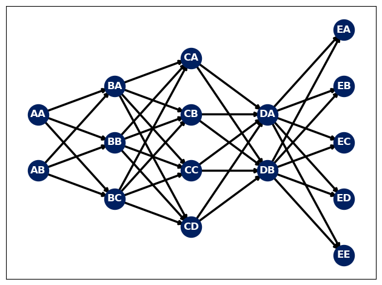

# A Simple feed forward neural network  

## A feed forward neural network built from scratch using the standard c++ library and pybind11 for seemless python integration. 

This project is built to run on Nvidia geforce rtx gpu's. Project goals:

- Create a fully connected neural network with a user defined architecture. 
- Module can be easily called from python.
- Trained network can be easily saved.
- Runs on gpu for synchronized computation of network.
- Network can be easily visualized.

## How to compile project.

1. Clone this project
2. Create a build folder in the MLP directory.
3. Run Make from the build directory
4. Python package can be accessed from build directory using "import MLP"

## How to use package.


```python
import MLP

import networkx as nx 
import matplotlib.pyplot as plt
```

## Random set of input data (For demonstration purposes)

- training_data must be passed in as a list of list of list, with a shape of [number of epochs][number of samples per epoch][number of nodes in input layer]

- labes must be passed in as a list of list of list, with a shape of [number of epochs][number of samples per epoch][number of nodes in output layer]


```python
training_data = [[[2., 2.] for _ in range(4)], [[2., 2.] for _ in range(4)]] # Data to be fed into input layer.
labels = [[[1. , 1., 1., 1., 1.] for _ in range(4)], [[1. , 1., 1., 1., 1.] for _ in range(4)]] # Data used to calculate error for backpropagation. 
```

## Set neural network parameters

- architecture is a list containing the number of nodes in each layer.
- learning_rate is a float smaller than 1
- network_type and activation_type must be set to 0. The ability to change network and activation type has not been added yet.


```python
architecture = [2,3,4,2,5] # Length of list is the number of layers in network.
learning_rate = 0.001 
network_type = 0 
activation_type = 0 

A = MLP.TrainNet() # Create an instance of network
A.set(training_data, labels, network_type, architecture, learning_rate, activation_type)
```

# Visualize network using networkx and matplotlib


```python
network_connections = A.net_connections() #network connections

connects = []
pos = {}
for i, layers in enumerate(network_connections):
    for j, nodes in enumerate(layers[::-1]):
        for k, connections in enumerate(nodes):
            pos[connections[0]] = ((i, j - (.5*len(layers))))
            connects.append((connections[0], connections[1]))  

for i, layers in enumerate(network_connections[-1:]):
    for j, nodes in enumerate(layers[::]):
        for k, connections in enumerate(nodes[::-1]):
            pos[connections[1]] = (((len(network_connections)), k - (.5*len(nodes))))

# Plot network
G = nx.DiGraph()
G.add_edges_from(connects)
# pos = nx.spring_layout(G)
nx.draw_networkx_nodes(G,pos,node_size=600, node_color="#002060")
nx.draw_networkx_edges(G,pos,edgelist=G.edges(),edge_color="black", width=2.5)
nx.draw_networkx_labels(G,pos, font_color="#FFFFFF", font_weight=700)
# plt.show()
plt.tight_layout()
```


    

    


# Train neural network using given data.

- Training is done for a number of iterations defined by user.


```python
iterations = 1000

# Train network
A.run_gpu(iterations)
```

     cost:0.174777

# Extract weights and biases from neural network


```python
weights, biases = A.all_weights(), A.all_biases()  # Network parameters are a list that can be saved using numpy.
```

# Trained network can be used by giving weights and biases to a new network.
- New inputs can be given to the network and the outputs can be queried.


```python
NewNetwork = MLP.RunNet() # Instance of new network. 

new_inputs = [1., 1.] # New data to be fed through neural network. Must be a list with a size equal to the number of input nodes. 

NewNetwork.set(new_inputs, weights, biases, architecture, activation_type) # All other parameters have been defined.
NewNetwork.run() # Propagate network.
```

# Query outputs of the neural network


```python
layer_id = 4
node_ids_in_last_layer = [0,1,2,3,4]

for node_id in node_ids_in_last_layer:
    output = NewNetwork.get_node(layer_id, node_id)
    print(node_id," :", output)
```

    0  : 0.6909144031341715
    1  : 0.6909144031341715
    2  : 0.6068217544182446
    3  : 0.6068217544182446
    4  : 0.5010139980503648


```python

```


```python

```
